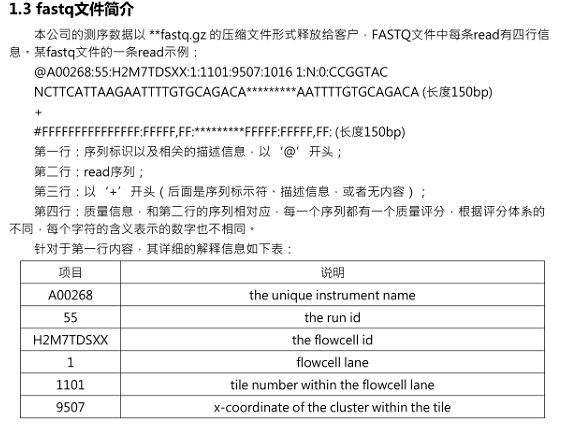
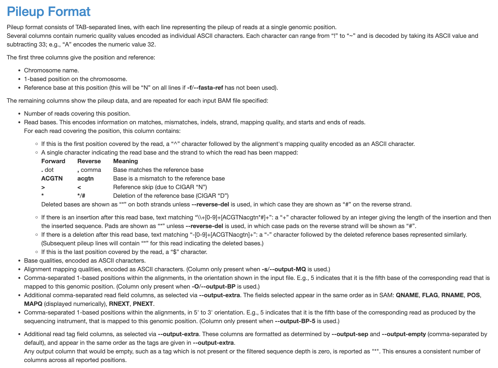

# 通过重测序数据提取protein和cds序列

## 用到的软件

| software | version |
| :------: | :-----: |
| samtools |  1.14   |
|  fastp   | 0.20.0  |
|   bwa    | 0.7.17  |
|   gatk   |  3.7.0  |
|  picard  | 2.23.6  |

## 序列过滤、比对和snp calling

### reads filter by *fastp*

```bash
fastp -w 5 -i PREFIX.R1.fastq -I PREFIX.R2.fastq -o PREFIX.R1.clean.fastq -O PREFIX.R2.clean.fastq -j PREFIX.json -h PREFIX.html -R "PREFIX reprot"
-w, thread to use
Alternative options:
-M, --cut_mean_quality               the mean quality requirement option(Q20) (int [=20])   
-q, --qualified_quality_phred        the quality value that a base is qualified. Default 15 means phred quality >=Q15 is qualified. (int [=15])
-n, --n_base_limit                   if one read's number of N base is >n_base_limit, then this read/pair is discarded. Default is 5 (int [=5])
-e, --average_qual                   if one read's average quality score <avg_qual, then this read/pair is discarded. Default 0 means no requirement (int [=0])
```

### build index for reference genome by *bwa and samtools*

```
bwa index REFERENCE_GENOME.fasta
samtools faidx REFERENCE_GENOME.fasta
```

### align reads by *bwa*

```
bwa mem -t 5 REFERENCE_GENOME.fasta PREFIX.R1.clean.fasta PREFIX.R2.clean.fasta -o PREFIX.sam 2>>PREFIX.err
-t, thread to use
```

### convert sam files to bam format by *samtools*

```
samtools view -t REFERENCE_GENOME.fasta.fai PREFIX.sam -o PREFIX.bam
```

### filter bam by flags and sort by *samtools*

```
samtools view -f 2 -b -@ 5 PREFIX.bam -o PREFIX.paired.bam    
-@, thread to use;
-f, only include reads with all  of the FLAGs in INT present.
samtools sort -@ 5 PREFIX.paired.bam -o PREFIX.sorted.bam
```

### add read group information by *picard*




```
picard -XX:ParallelGCThreads=4 -Xmx4g AddOrReplaceReadGroups I=PREFIX.sorted.bam O=PREFIX.rgadded.bam SORT_ORDER=coordinate CREATE_INDEX=True VALIDATION_STRINGENCY=LENIENT RGSM=PREFIX RGID=A00268.1 RGPL=ILLUMINA RGLB=H2M7TDSXX.1 RGPU=A00268H2M7TDSXX.1
```

### remove duplicates by *samtools*

```
java -XX:ParallelGCThreads=4 -Xmx4g -jar picard.jar MarkDuplicates I=PREFIX.rgadded.bam O=PREFIX.rmduped.bam M=PREFIX.metrics.txt CREATE_INDEX=true REMOVE_DUPLICATES=true
```

### realign indels by *gatk*

```
java -Xmx2g -XX:ParallelGCThreads=4 -jar GenomeAnalysisTKLite.jar -T RealignerTargetCreator -R REFERENCE_GENOME.fasta -I PREFIX.rmduped.bam -o PREFIX.intervals
java -Xmx2g -XX:ParallelGCThreads=4 -jar GenomeAnalysisTKLite.jar -T IndelRealigner -R REFERENCE_GENOME.fasta -I PREFIX.rmduped.bam -targetIntervals PREFIX.intervals -o PREFIX.realigned.bam
samtools index PREFIX.realigned.bam
```

### make pileup file by *samtools*

```
samtools mpileup PREFIX.realigned.bam -C 50 -f REFERENCE_GENOME.fasta -s -q 20 -Q 20 -o PREFIX.allsites.pileup -aa --output-MQ 2>>mpileup.err
```



---

## 提取和转换序列信息

```bash
perl gff_sort.pl PREFIX.gff PREFIX.sorted.gff

# 记得根据测序深度修改filter的阈值
# 如果用附带的scipts文件夹中的脚本，分别在第76行和第113行
# 如果用本md文件下的脚本，分别在68和102行
perl pileup2cds.pl PREFIX.sorted.gff PREFIX.allsites.pileup
cat *fa >PREFIX.cds
mkdir fas
mv *fa fas

# cds转换为protein，任何不在密码子表中的codon会被转换为‘X’
perl cds2pro.pl PREFIX.cds >PREFIX.pro

# 检查每条序列中包含的‘X’的个数
perl Err_AA_Ratio.pl REF.pro PREFIX.pro

# 根据上一步生成的[genelist.ratio.list]文件中的‘X’含量分布修改第九行中的阈值
perl Filter_Pro.pl PREFIX.pro >PREFIX.filtered.pro
```

---

## Scripts

<details>
    <summary>gff_sort.pl</summary>
    <pre><blockcode>
    # This script is used to sort gff file with chromosome ID and gene position.
use 5.010;
use strict;
use autodie;
my (@Chroms,%Genes,%Position,%Num,%mRNA,%CDS);
open GFF,"<","$ARGV[0]";
open SORTEDGFF,">","$ARGV[1]";
while (<GFF>) {
        my $line=$_;
        s/\s+$//;
        my ($Chrom,$Type,$Sta,$End,$Stat)=(split/\s+/)[0,2,3,4,-1];
        $Stat=~m/=(.*);/;
        my $GeneName=$1;
        $mRNA{$GeneName}=$line if $Type eq "mRNA";
        next if $Type ne 'CDS';
        my @Position=($Sta,$End);
        @Position=sort {$a<=>$b} @Position;
        push @Chroms,$Chrom unless $Chrom~~@Chroms;
        push @{$Genes{$Chrom}},$GeneName unless $GeneName~~$Genes{$Chrom};
        $Num{$GeneName}++;
        $Position{$GeneName}->[$Num{$GeneName}]=[@Position];
        $CDS{$GeneName}->[$Num{$GeneName}]=$line;
}
@Chroms=map {$_->[0]}
                sort {$a->[1]<=>$b->[1]}
                map {my $Chrom=$_;$Chrom=~m/(\d+)$/;my $temp=$1;[$Chrom,$1]} @Chroms;
foreach my $Chrom (@Chroms) {
        my %Numbers;
        my @GeneNames=@{$Genes{$Chrom}};
        foreach my $GeneName (@GeneNames) {
				my @temp=sort {$Position{$GeneName}->[$a][0]<=>$Position{$GeneName}->[$b][0]} (1..$Num{$GeneName});
				$Numbers{$GeneName}=[@temp];
		}
        @GeneNames=sort {$Position{$a}->[$Numbers{$a}->[0]][0]<=>$Position{$b}->[$Numbers{$b}->[0]][0]} @GeneNames;
        foreach my $GeneName (@GeneNames) {
print "$GeneName\t$Position{$GeneName}->[@{$Numbers{$GeneName}}[0]][0]\n";
	       print SORTEDGFF "$mRNA{$GeneName}";
                foreach my $Number (@{$Numbers{$GeneName}}) {
                        print SORTEDGFF "$CDS{$GeneName}->[$Number]";
                }
        }
}
    </blockcode></pre>
</details>

<details>
    <summary>pileup2cds.pl</summary>
    <pre><blockcode>
    # Modify the depth thresholds in line 68 and line 102 according to the average sequencing depth.
use 5.010;
use strict;
use autodie;
die "Usage: perl $0 [GFF file] [PILE file]" if @ARGV != 2;
open GFF,"<","$ARGV[0]";
my (%GeneNames,%GeneCounts,%CDSCounts,%Position,%Direction);
GFFLINE: while (<GFF>) {
    my $line=$_;
    s/\s+$//;
    my ($Chrom,$Type,$Sta,$End,$Direction,$Stat)=(split/\s+/)[0,2,3,4,6,8];
    $Stat=~m/=(.*);/;
    my $GeneName=$1;
    if ($Type eq 'mRNA') {
        $GeneCounts{$Chrom}=-1 if !exists $GeneCounts{$Chrom};
        $GeneCounts{$Chrom}++;
        push @{$GeneNames{$Chrom}},$GeneName;
        $Direction{$GeneName}=$Direction;
    } else {
        my @Position=($Sta,$End);
        @Position=sort {$a<=>$b} @Position;
        $CDSCounts{$GeneName}=-1 if (!exists $CDSCounts{$GeneName});
        $CDSCounts{$GeneName}++;
        $Position{$GeneName}->[$CDSCounts{$GeneName}]=[@Position];
    }
}
close GFF;
open PILE,"<","$ARGV[1]";
my $LineCounts=0;
my (%CDSSequence,%FinishedCDSCounts,%FinishedGeneCounts);
PILELINE: while (<PILE>) {
    my $Line=$_;
    $LineCounts++;
    s/\s+$//;
    my ($Chrom,$Position,$Ref,$Depth,$Base,$BaseQuality,$MappingQuality)=(split/\s+/);
    $FinishedGeneCounts{$Chrom}=0 if (!exists $FinishedGeneCounts{$Chrom});
    next PILELINE if ($FinishedGeneCounts{$Chrom}>$GeneCounts{$Chrom});
    my $GeneName=@{$GeneNames{$Chrom}}[$FinishedGeneCounts{$Chrom}];
    next PILELINE if (!defined $GeneName);
	$FinishedCDSCounts{$GeneName}=0 if (!exists $FinishedCDSCounts{$GeneName});
    if ($FinishedCDSCounts{$GeneName}==$CDSCounts{$GeneName}+1) {
        $FinishedGeneCounts{$Chrom}++;
        my %CDS;
        if ($Direction{$GeneName} eq '+') {
            for (my $i = 0; $i <= $CDSCounts{$GeneName}; $i++) {
                $CDS{$GeneName}.=$CDSSequence{$GeneName}->[$i];
            }
        } else {
            for (my $i = $CDSCounts{$GeneName}; $i >= 0; $i--) {
                my $Reverse_Complementary_Sequence = reverse_complementarity ($CDSSequence{$GeneName}->[$i]);
                $CDS{$GeneName}.=$Reverse_Complementary_Sequence;
            }
        }
        my $length=length $CDS{$GeneName};
        warn "The length of CDS sequence of gene \'$GeneName\' is $length, not an integer multiple of three at $LineCounts\n" if ($length % 3 != 0);
        open OUT,">","$GeneName\.fa";
        print OUT ">$GeneName\n$CDS{$GeneName}\n";
    } else {
        my $GeneName=@{$GeneNames{$Chrom}}[$FinishedGeneCounts{$Chrom}];
        my @pos=@{$Position{$GeneName}->[$FinishedCDSCounts{$GeneName}]};
        my ($sta,$end)=@pos[0,1];
        if ($Position<$sta) {
            next PILELINE;
        } else {
            if ($Depth<=5) {
                $CDSSequence{$GeneName}->[$FinishedCDSCounts{$GeneName}].='N';
                $FinishedCDSCounts{$GeneName}++ if $Position==$end;
            } else {
                $Base=~s/\$|\^[\000-\177]{1}//g;
                my @IndelCounts=($Base=~/[\+\-]([0-9]+)[ACGTNacgtn]+/g);
                my (@Bases,@BaseQualities,@MappingQualities);
                for (@IndelCounts) {
                    $Base=~s/[\+\-][0-9]+[ACGTNacgtn]{$_}//;
                }
                @Bases=split//,$Base;
                @BaseQualities=split//,$BaseQuality;
                @MappingQualities=split//,$MappingQuality;
                if (@Bases!=@BaseQualities || @Bases!=@MappingQualities) {
                    print "$Line\n";
                    print "\@Bases=","scalar(@Bases)",",\@BaseQualities=","scalar(@BaseQualities)","\n";
                    die("die at line $LineCounts \@read != \@baseq \n");
                }
                    my $EffectiveDepth=0;
                    my %AlleleCount='';
                  BASE: for (1..@Bases) {
                        my $Base=shift @Bases;
                        if ($Base eq '.' || $Base eq ',') {
                            $Base=$Ref;
                        } else {
                            $Base=uc($Base);
                        }
                        my $TheBaseQuality=shift @BaseQualities;
                        my $TheMappingQuality=shift @MappingQualities;
                        next BASE if (ord($TheBaseQuality)-33<=20);
                        next BASE if (ord ($TheMappingQuality)-33<=20);
                        $EffectiveDepth++;
                        $AlleleCount{$Base}++;
                  }
                if ($EffectiveDepth>=200 || $EffectiveDepth <= 5) {
                    $CDSSequence{$GeneName}->[$FinishedCDSCounts{$GeneName}].='N';
                } else {
                  my @ATCG=sort {$AlleleCount{$b}<=>$AlleleCount{$a}} keys %AlleleCount;
                    if (@ATCG>=3) {
                        if ($AlleleCount{$ATCG[2]}/$EffectiveDepth>=0.05) {
                            $CDSSequence{$GeneName}->[$FinishedCDSCounts{$GeneName}].='N';
                       } elsif ($AlleleCount{$ATCG[1]}/$EffectiveDepth>=0.1 && $AlleleCount{$ATCG[1]}>=2) {
                            my @Alleles=($ATCG[0],$ATCG[1]);
                            my $DegeneratedBase=&bases_degeneration (@Alleles);
                            $CDSSequence{$GeneName}->[$FinishedCDSCounts{$GeneName}].=$DegeneratedBase;
                        } else {
                            $CDSSequence{$GeneName}->[$FinishedCDSCounts{$GeneName}].=$ATCG[0];
                        }
                    } elsif (@ATCG==2) {
                        if ($AlleleCount{$ATCG[1]}/$EffectiveDepth>=0.1 && $AlleleCount{$ATCG[1]}>=2) {
                            my @Alleles=($ATCG[0],$ATCG[1]);
                            my $DegeneratedBase=&bases_degeneration (@Alleles);
                            $CDSSequence{$GeneName}->[$FinishedCDSCounts{$GeneName}].=$DegeneratedBase;
                        } else {
                            $CDSSequence{$GeneName}->[$FinishedCDSCounts{$GeneName}].=$ATCG[0];
                        }
                    } else {
                        $CDSSequence{$GeneName}->[$FinishedCDSCounts{$GeneName}].=$ATCG[0];
                    }
                }
                $FinishedCDSCounts{$GeneName}++ if $Position==$end;
            }
        }
    }
}
sub bases_degeneration {
    my @Bases=sort map {uc($_)} @_;
    if (@Bases==0) {
        warn "There's no avail bases";
    }
    my $Base=join("",@Bases);
    my %DegeneratedBase=(
            'AG' => 'R',
            'CT' => 'Y',
            'AC' => 'M',
            'GT' => 'K',
            'AT' => 'W',
            'CG' => 'S',
            'ACT' => 'H',
            'CGT' => 'B',
            'ACG' => 'V',
            'AGT' => 'D',
            'ACGT' => 'N',
    );
    return $DegeneratedBase{$Base};
}
sub reverse_complementarity {
    my $Seq= $_[0];
    $Seq=~s/A/a/g;
    $Seq=~s/C/b/g;
    $Seq=~s/T/A/g;
    $Seq=~s/G/C/g;
    $Seq=~s/a/T/g;
    $Seq=~s/b/G/g;
    $Seq=join("",(reverse (split//,$Seq)));
    return $Seq;
}
    </blockcode></pre>
</details>

<details>
    <summary>cds2pro.pl</summary>
    <pre><blockcode>
    %genetic_code=(
     "TCA" =>  "S",    # Serine
     "TCC" =>  "S",    # Serine
     "TCG" =>  "S",    # Serine
     "TCT" =>  "S",    # Serine
     "TTC" =>  "F",    # Phenylalanine
     "TTT" =>  "F",    # Phenylalanine
     "TTA" =>  "L",    # Leucine
     "TTG" =>  "L",    # Leucine
     "TAC" =>  "Y",    # Tyrosine
     "TAT" =>  "Y",    # Tyrosine
     "TAA" =>  "*",    # Stop
     "TAG" =>  "*",    # Stop
     "TGC" =>  "C",    # Cysteine
     "TGT" =>  "C",    # Cysteine
     "TGA" =>  "*",    # Stop
     "TGG" =>  "W",    # Tryptophan
     "CTA" =>  "L",    # Leucine
     "CTC" =>  "L",    # Leucine
     "CTG" =>  "L",    # Leucine
     "CTT" =>  "L",    # Leucine
     "CCA" =>  "P",    # Proline
     "CCC" =>  "P",    # Proline
     "CCG" =>  "P",    # Proline
     "CCT" =>  "P",    # Proline
     "CAC" =>  "H",    # Histidine
     "CAT" =>  "H",    # Histidine
     "CAA" =>  "Q",    # Glutamine
     "CAG" =>  "Q",    # Glutamine
     "CGA" =>  "R",    # Arginine
     "CGC" =>  "R",    # Arginine
     "CGG" =>  "R",    # Arginine
     "CGT" =>  "R",    # Arginine
     "ATA" =>  "I",    # Isoleucine
     "ATC" =>  "I",    # Isoleucine
     "ATT" =>  "I",    # Isoleucine
     "ATG" =>  "M",    # Methionine
     "ACA" =>  "T",    # Threonine
     "ACC" =>  "T",    # Threonine
     "ACG" =>  "T",    # Threonine
     "ACT" =>  "T",    # Threonine
     "AAC" =>  "N",    # Asparagine
     "AAT" =>  "N",    # Asparagine
     "AAA" =>  "K",    # Lysine
     "AAG" =>  "K",    # Lysine
     "AGC" =>  "S",    # Serine
     "AGT" =>  "S",    # Serine
     "AGA" =>  "R",    # Arginine
     "AGG" =>  "R",    # Arginine
     "GTA" =>  "V",    # Valine
     "GTC" =>  "V",    # Valine
     "GTG" =>  "V",    # Valine
     "GTT" =>  "V",    # Valine
     "GCA" =>  "A",    # Alanine
     "GCC" =>  "A",    # Alanine
     "GCG" =>  "A",    # Alanine
     "GCT" =>  "A",    # Alanine
     "GAC" =>  "D",    # Aspartic Acid
     "GAT" =>  "D",    # Aspartic Acid
     "GAA" =>  "E",    # Glutamic Acid
     "GAG" =>  "E",    # Glutamic Acid
     "GGA" =>  "G",    # Glycine
     "GGC" =>  "G",    # Glycine
     "GGG" =>  "G",    # Glycine
     "GGT" =>  "G",    # Glycine
);
open(IN,"$ARGV[0]") or die $!;
while(<IN>){
	chomp;
	if($_=~/^\>/){
		$id=$_;
		$id=~s/\>//;
		}
	else{
		$cds{$id}.=$_;
		}
	}
foreach $key(sort keys %cds){
	for(my $i=0;$i<length($cds{$key})-2;$i+=3){
		$codon=substr($cds{$key},$i,3);
		if(exists $genetic_code{$codon}){
			$aa.=$genetic_code{$codon};
			}
		else{
			$aa.="X";
			}
		}
	print "\>$key\n$aa\n";
	$aa="";
	}
close IN;
    </blockcode></pre>
</details>

<details>
    <summary>Err_AA_Ratio.pl</summary>
    <pre><blockcode>
open IN1,"<","$ARGV[0]";
open IN2,"<","$ARGV[1]";
open LIST,">","genelist.ratio";
open HIST,">","genelist.ratio.list";
while (<IN1>) {
	if (/^>/) {
		s/\s+$//;
		s/^>//;
		$id=$_;
	} else {
		s/\s+$//;
		s/\*$//;
		my $seq1=$_;
		$seq1{$id}=$seq1;
	}
}
close IN1;
while (<IN2>) {
	if (/^>/) {
		s/\s+$//;
		s/^>//;
		$id=$_;
	} else {
		s/\s+$//;
		s/\*$//;
		my $seq2=$_;
		my $seq1=$seq1{$id};
		my @seq1=split//,$seq1;
		my @seq2=split//,$seq2;
		my $length=length $seq2;
		for (1..$length) {
			my $base1=shift @seq1;
			my $base2=shift @seq2;
			$SameBase++ if $base1 eq $base2;
		}
		my $ratio=$SameBase/$length;
		print LIST "$id\t$ratio\n";
		$num{$ratio}++;
		$hist=int($ratio*100+0.5)/100;
		$freq{$hist}++;
		$sum++;
		undef $SameBase;
	}
}
map {my $ratio=$freq{$_}/$sum;$accu+=$ratio;print HIST "$_\t$ratio\t$accu\n"} (sort {$b<=>$a} keys %freq);
    </blockcode></pre>
</details>

<details>
    <summary>Filter_Pro.pl</summary>
    <pre><blockcode>
# Remember to modify the filter threshold.    
while (<>) {
	if (/^>/) {
		$id=$_;
	} else {
		s/\s+$//;
		my $seq=$_;
		my $gap=grep /X/,(split //,$_);
print STDERR "$gap\n";
		my $length=length $seq;
		print "$id$seq\n" if ($gap/$length<=0.2);
	}
}
(base) [lisen@shilab cdss]$ cat filter.pl
while (<>) {
	if (/^>/) {
		$id=$_;
	} else {
		s/\s+$//;
		my $seq=$_;
		my $gap=grep /X/,(split //,$_);
print STDERR "$gap\n";
		my $length=length $seq;
		print "$id$seq\n" if ($gap/$length<=0.2);
	}
}
    </blockcode></pre>
</details>


